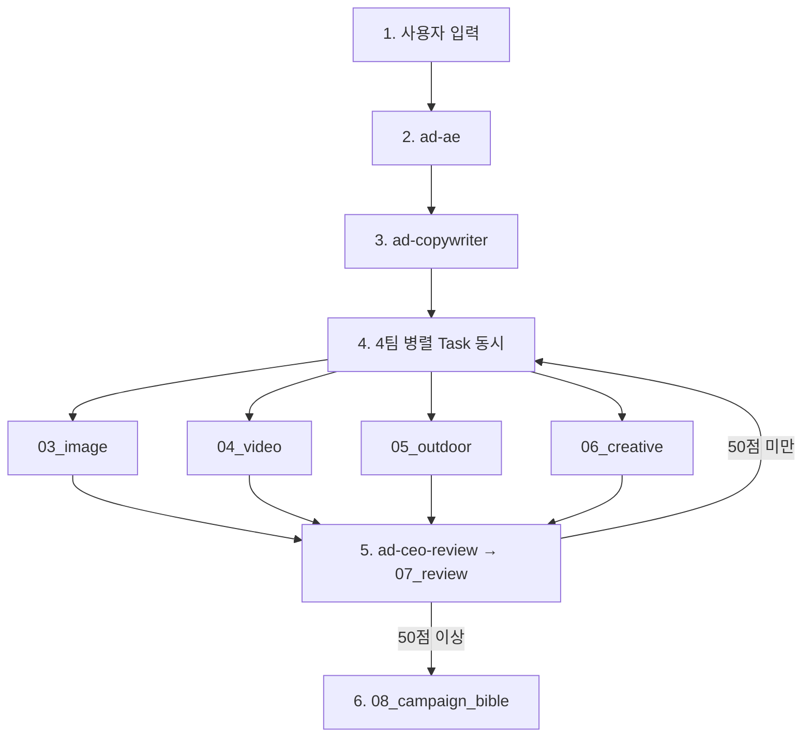

# 광고 대행사 서브에이전트 (AD_AGENCY)

> 위치: `.cursor/agents/*.md`  
> 오케스트레이션: [`.cursor/skills/ad-agency/SKILL.md`](../skills/ad-agency/SKILL.md)

## 워크플로우

## 산출물 경로

| 번호 | 경로 | 에이전트 |
|------|------|----------|
| 01 | `deliverables/01_ae_brief.md` | ad-ae |
| 02 | `deliverables/02_copy.md` | ad-copywriter |
| 03 | `deliverables/03_image.md` | ad-image-team |
| 04 | `deliverables/04_video.md` | ad-video-team |
| 05 | `deliverables/05_outdoor.md` | ad-outdoor-team |
| 06 | `deliverables/06_creative.md` | ad-creative-team |
| 07 | `deliverables/07_review.md` | ad-ceo-review (부모가 저장) |
| 08 | `deliverables/08_campaign_bible.md` | 스킬 6단계 통합 |

## 에이전트 목록

| 순서 | 파일 | 배경 | readonly |
|------|------|------|----------|
| 1 | `ad-ae.md` | ✗ | ✗ |
| 2 | `ad-copywriter.md` | ✗ | ✗ |
| 3-1~4 | `ad-image/video/outdoor/creative-team.md` | **✓** | ✗ |
| 4 | `ad-ceo-review.md` | ✗ | **✓** |

## 4팀 병렬

- `is_background: true` + 스킬 4단계에서 **Task 4개 동시 호출**
- 하나라도 순차만 하면 한 팀씩 실행됨

## WK2 전용 (NAVER_team 1 · week02)

| 파일 | 역할 | readonly |
|------|------|----------|
| `my-ae.md` | Nuri–Rookie Event Chain AE 기획 | ✗ |
| `my-copywriter.md` | 발표·KR/EN 카피 | ✗ |
| `my-reviewer.md` | 5+2 검수 (50/70 통과) | **✓** |

산출: `deliverables/my_ae_brief.md` · `my_copy.md` · `my_review.md`  
Read: `NAVER_team 1/docs/week02/[WK2][00]*` 등

## 호출

- 스킬: `@ad-agency` 또는 「광고 대행사 워크플로우 실행」
- WK2: `@my-ae` → `@my-copywriter` → `@my-reviewer`
- 단독: `Task(subagent_type="my-ae", …)`
